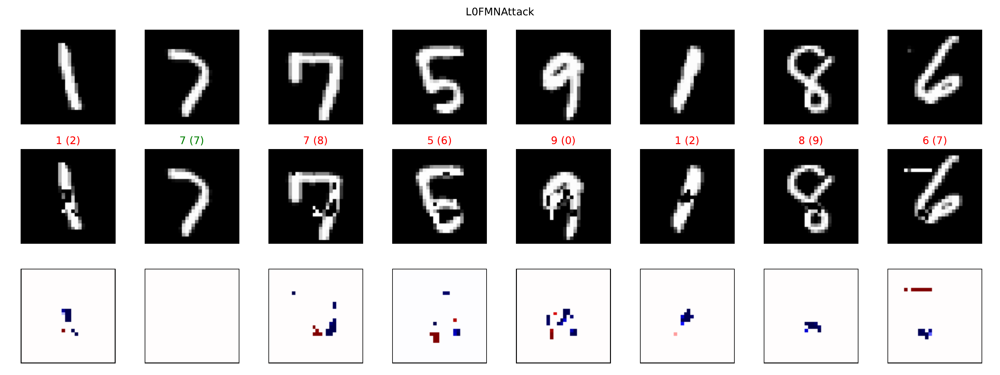
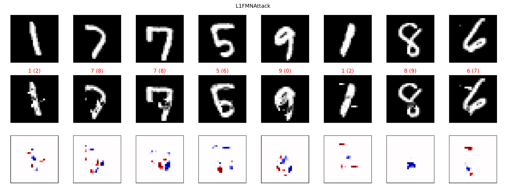
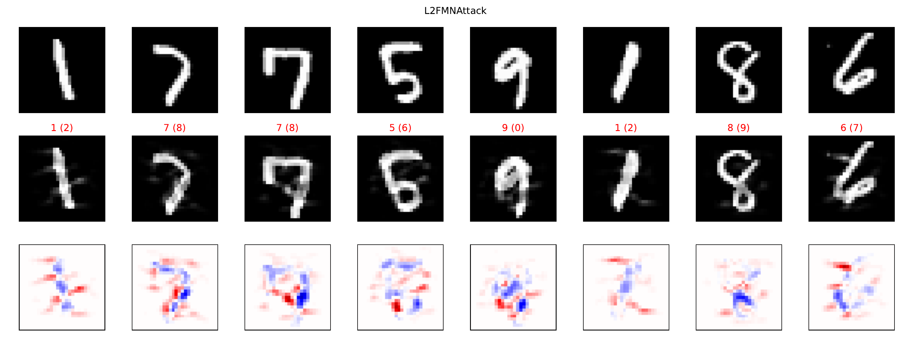
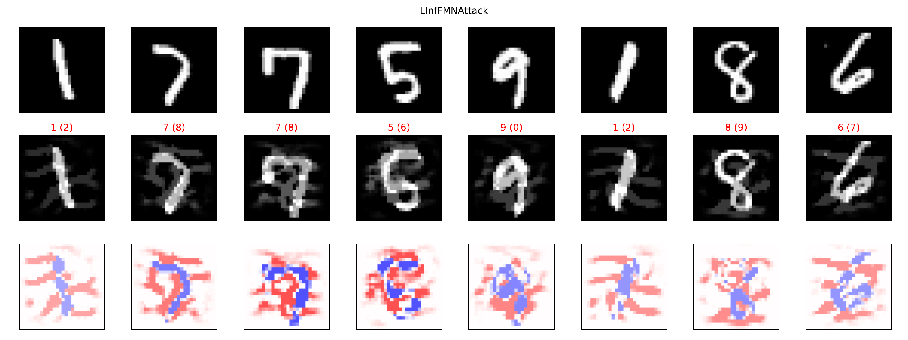

# Fast-Minimum-Norm-FMN-Attack

The Fast Minimum Norm Attack (FMN), from 
Fast Minimum-norm Adversarial Attacks through Adaptive Norm Constraints.

The attack is developed with [Foolbox](https://foolbox.readthedocs.io/en/stable/).

For a quick demo example, check out [this notebook](src/fmn_example.ipynb).

For a more complete example, with different datasets and robust models, check out 
the [full example notebook](src/fmn_demo.ipynb).

Here is a conceptual figure of the attack. In summary, the algorithm performs normalized 
gradient descent and projects into an epsilon Lp-ball which is adapted to 
find the minimum norm adversarials.

<small> GIF created with [SecML](https://secml.gitlab.io/).</small>

These are results against a MNIST 9-layer ConvNet. Check out the [notebooks](src/fmn_demo.ipynb) for more examples.

